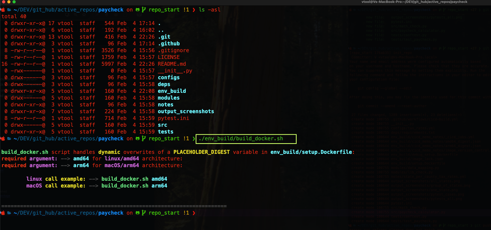

# Paycheck Calculator
##  Lightweight Python-based paycheck calculator: <br> 
- Computes `net pay` based on: <br>
    `tax brackets`: <br>
    `deductions`: <br>
    `marital status`: <br>
    US `State` by `State`: <br>
- supports configurable `pay periods`: <br>
---
This project is licensed under the [MIT License](LICENSE). You are free to use, modify, and distribute this software under the terms of the license.

## Tax Rate Disclaimer:
`NOTE`: Tax rates vary `state` by `state` as well as by `city/county` in some cases: <br> 
The [tax-rates](configs/tax_rates.yml) config file contains state, local, and federal tax rates used by this calculator `However`, tax laws and rates are subject to change: <br> 
To ensure accuracy, you may need to `update` the configuration file regularly based on official tax sources: <br> 
`Failure` to update the config may result in incorrect paycheck calculations:<br>
Official tax rate sources:
- [IRS Federal Tax Brackets](https://www.irs.gov/)
- [State Tax Departments](https://www.taxadmin.org/state-tax-agencies) <br>
Side Note: You may also refer to an alternative [tax-rates-notes](notes/state_per_county_tax_rates.yml) config kept in this repo for reference:
---
# Features:
>- Supports `federal` and `state` income tax calculations:<br>
>- Configurable tax rates via [tax-rates](configs/tax_rates.yml) files: <br>
>- Supports different pay periods:<br>
    `hourly` <br>
    `weekly` <br>
    `biweekly` <br>
    `semi_monthly` <br>
>- Unit [pytest](tests/test_paycheck.py) included: <br>
>- Containerized execution as `py venev` replacemnt using [Docker-Support](env_build/setup.Dockerfile): <br>
---

## Repository Container Structure:
```bash
/paycheck# ls -als
total 84
8 drwxr-xr-x 1 root root 4096 Feb  5 04:21 .
4 drwxr-xr-x 1 root root 4096 Feb  5 04:19 ..
4 drwxr-xr-x 7 root root 4096 Feb  5 00:04 .git
4 drwxr-xr-x 3 root root 4096 Feb  4 23:14 .github
4 -rw-r--r-- 1 root root 3526 Feb  4 21:56 .gitignore
4 -rw-r--r-- 1 root root 1759 Feb  4 21:57 LICENSE
8 -rw-r--r-- 1 root root 4922 Feb  4 23:07 README.md
0 -rwx------ 1 root root    0 Feb  4 21:57 __init__.py
4 drwx------ 2 root root 4096 Feb  4 21:57 configs
4 drwx------ 2 root root 4096 Feb  4 21:58 deps
4 drwxr-xr-x 2 root root 4096 Feb  5 04:07 env_build
8 drwx------ 1 root root 4096 Feb  5 04:22 modules
4 drwxr-xr-x 2 root root 4096 Feb  4 21:58 notes
4 drwxr-xr-x 2 root root 4096 Feb  4 21:58 output_screenshots
4 -rw-r--r-- 1 root root  714 Feb  4 21:59 pytest.ini
8 drwx------ 1 root root 4096 Feb  5 04:22 src
8 drwxr-xr-x 1 root root 4096 Feb  5 04:22 tests
/paycheck# tree .

|-- LICENSE
|-- README.md
|-- __init__.py
|-- configs
|   `-- tax_rates.yml
|-- deps
|   `-- requirements.txt
|-- env_build
|   |-- build_docker.sh
|   |-- image_digests.ini
|   |-- setup.Dockerfile
|   `-- setup.Dockerfile.bak
|-- modules
|   |-- data_mapping.py
|   `-- lib_check.py
|-- notes
|   `-- state_per_county_tax_rates.yml
|-- output_screenshots
|   |-- all_states.png
|   |-- group_of_states.png
|   |-- one_state.png
|   |-- pytest_cases.png
|   `-- pytests_all.png
|-- pytest.ini
|-- src
|   |-- math_check.py
|   `-- paycheck_calculator.py
`-- tests
    |-- conftest.py
    `-- test_paycheck.py

9 directories, 22 files
/paycheck#
```

## Dependencies:
>- Python [requirements](deps/requirements.txt) libs: 
```bash
    coverage~=7.6.10 
    pytest~=8.3.4
    pytest-benchmark~=5.1.0
    pytest-cov~=6.0.0
    pytest-timeout~=2.3.1
    pytz~=2024.2
    PyYAML~=6.0.2
    colorama~=0.4.6
    tabulate~=0.9.0
    yml~=0.0.1
    setuptools~=75.8.0
    uncompyle6~=3.9.2
    rich~=13.9.4
```
>- Docker Engine:

## Setup & Install:
```bash
git clone https://github.com/Vlad-1618M/paycheck.git
cd paycheck
```
### Option 1: <br> Build Using build_docker.sh [ Recommended ]
>- Run [build_docker.sh](./env_build/build_docker.sh) script | follow user prompts 



### Option 2: <br> Manual Build Without [build_docker.sh](./env_build/build_docker.sh)
If you prefer to build the container manually: <br>
>- Step 1. Export Architecture-Specific Digest
```bash
    export ARCH=arm64  # ... for macOS:
    export ARCH=amd64  # ... for Linux or != macOS:
    export DIGEST=$(awk -F ' = ' "/$ARCH/ {print \$2}" env_build/image_digests.ini)
    echo "Using Digest: $DIGEST"
```
>- Step 2️. Build Container:
```bash
docker build --build-arg DIGEST=$DIGEST -t paycheck:$ARCH --no-cache --progress=plain -f env_build/setup.Dockerfile .
```
>- Step 3. Run Container Image:
```bash
docker run -it paycheck:$ARCH bash
```
>- Step 4 Run Paycheck Calculator and follow user prompts:
```bash
python src/paycheck_calculator.py
```
---
## PyTest Configuration and Usage
### The configuration for pytest are in [pytest.ini](pytest.ini) file:

#### PyTest CLI Examples:
>- pytest -vv
>- pytest -m "slow"
>- pytest -m "not slow"
>- pytest -m "slow or integration"
>- pytest --cov=src --cov-report=term-missing
>- pytest -v -r charts
>- pytest -v -r fEsxX
>- pytest --cache-clear

#### [Test Suite](tests/test_paycheck.py): cli-examples:
``` bash
pytest 
pytest -v -r charts tests/test_paycheck.py
pytest -v -r fEsxX tests/test_paycheck.py
pytest -v -r charts -m "not slow" tests/test_paycheck.py
pytest --cache-clear -v -r charts tests/test_paycheck.py
pytest --cache-clear -v -r charts tests/test_paycheck.py::test_state_tax
pytest --cache-clear -v -r charts tests/test_paycheck.py::test_paycheck_calculations
pytest --cache-clear -v -r charts tests/test_paycheck.py::test_calculate_all_states
pytest --cache-clear -v -r charts tests/test_paycheck.py::test_federal_tax
```
>- Run [pytest suite](tests/test_paycheck.py):
```bash
pytest --cache-clear -v -r charts tests/test_paycheck.py
```
---
## Screenshots Examples:

***

***


# PyTest Configuration and Usage

This project leverages `pytest` for testing and includes mock and real test examples. Below are the details on running the tests, examples of commands, and visual outputs.

---

## Table of Contents
- [PyTest Configuration](#pytest.ini)
- [Config used in PyTest](configs/tax_rates.yml)
- [Markers and Test Selection](#conftest)
- [PyTests Screenshots & Examples](#pytest-screenshots--examples)

---

## Mock PyTests Screenshots Examples:

***

___
